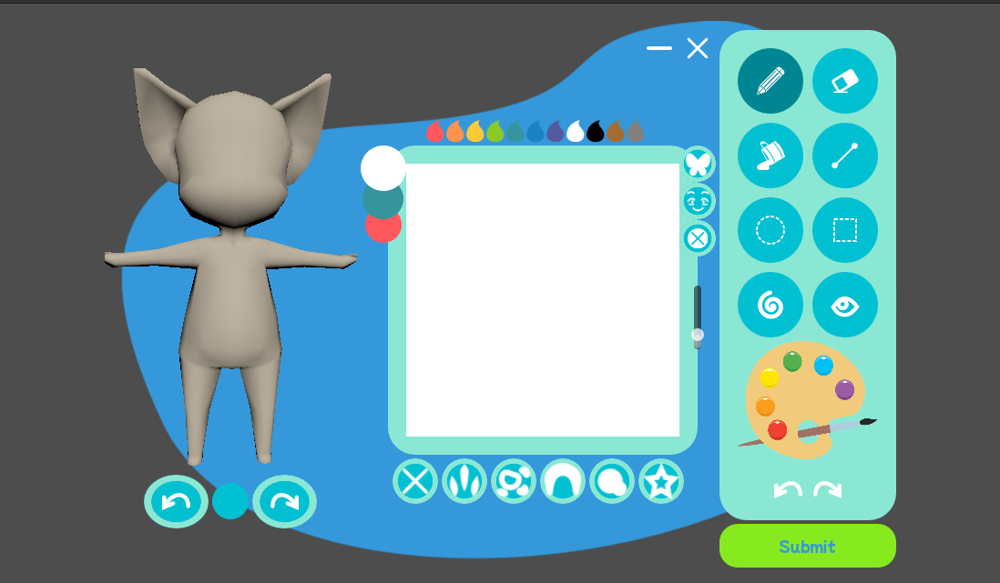
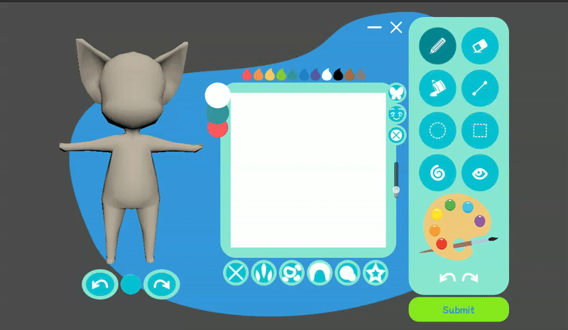

# Benthic Texture Editor 

This is a simple godot texture editor for drawing faces on an opensim compatable 3d model. 
The goal of this module is to allow users to quickly draw expressions for models while chatting in-game to allow users more self expression than with words alone.
A secondary goal is to create a simple tool to help keep player models visually consistent through the use of predefined color palettes, stamps, and models. By imposing creative restraints on the default editor tools, I hope to help less artistically inclined users quickly create something they feels represents them, while encouraging users who feel restricted by the constraints, but might not have much experience in 3d art, to make the jump into editing the textures themselves by providing user-friendly texture templates that can be imported into other drawing software.

The UI theming for this project is also highly modular. The theme is defined under themes/benthic_theme.gd, where the colors, icons and textures are defined. This allows for users to quickly create new cohesive themes using new shapes and colors, without having to manually change the palette of each UI element. 

## Getting Started 
Import the project into godot 4 and run! Needs no external dependencies.

## Demo 
working HTML5 demo can be found at
https://tutterypuff.itch.io/benthic-texture-editor

not quite as fast as offline versions, but still works! 

